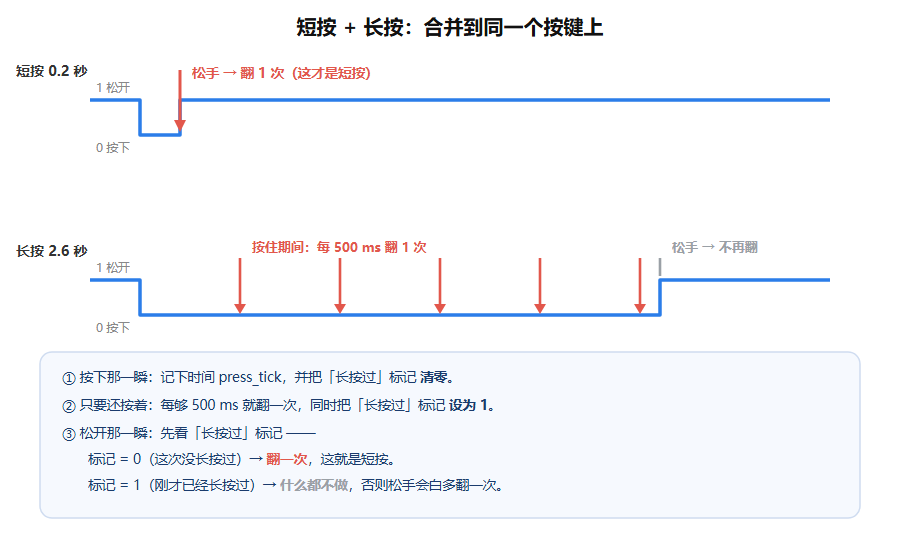

# 按键实验 ③：短按翻一次 + 长按连发（合并版）

> 上一步你已经做出来的：**按住 0.5 秒 → 开始连发**（但轻点没反应）。
> 这一步要加回来的：**轻点一下 → 翻一次**。两套逻辑同时生效。



## 一、这一课真正要学的东西：**标志变量**

现在程序面临一个全新的问题：

> 松手的时候，我要怎么知道"**刚才那一轮到底有没有长按过**"？

看时间图就明白：
- **短按**：松手时**要**翻一次
- **长按**：松手时**不能**再翻（因为按住期间已经翻够了）

可是松手那一瞬间，`HAL_GetTick()` 的差值是"按了多久"，看起来能判断……但不行：

| 情形 | 按住时长 | 差值 | 该翻吗 |
|---|---|---|---|
| 轻点 | 0.2 秒 | 200 | 要翻 1 次 |
| 按住 0.6 秒 | 0.6 秒 | 600 | 已经翻过 1 次了，**不能再翻** |

差值 600 > 500，按"够不够 500"去判断，会误以为它也该翻一次。**光看时长分不清。**

所以程序必须**额外记住一件事**：「这一轮按下，有没有进入过长按」。

做法就是加一个变量，专门当**记忆用的旗子**（flag）：

```c
uint8_t long_pressed = 0;   /* 0 = 这一轮没长按过；1 = 已经长按过了 */
```

- **按下时**：把它清成 `0`（新一轮开始，还没长按过）
- **进入连发时**：把它设成 `1`（打上"我长按过了"的标记）
- **松手时**：看这个标记
  - 还是 `0` → 说明这一轮没长按过 → 是短按 → **翻一次**
  - 是 `1` → 说明刚才已经连发过了 → **什么都不做**

> 这个"用一个变量记住刚才发生过什么"的思路，就是**状态机**的雏形。
> 以后做协议解析、按键双击、菜单界面，全靠它。面试问"你怎么处理按键双击"，答的就是这套。

## 二、要改的地方：`main.c`

### 改动 1：再加一个变量

在 `uint32_t press_tick = 0;` 那行**下面**加：

```c
  uint8_t  long_pressed = 0;    /* 这一轮按下，有没有进入过长按 */
```

### 改动 2：`while (1)` 里换成下面这份（4 个空）

```c
  while (1)
  {
    uint8_t now = HAL_GPIO_ReadPin(BTN_GPIO_Port, BTN_Pin);

    /* ---------- ① 按下那一瞬 ---------- */
    if (last == GPIO_PIN_SET && now == GPIO_PIN_RESET)
    {
      press_tick   = HAL_GetTick();
      long_pressed = ______;          /* 空1：刚按下，还没长按过，设成几？ */
    }

    /* ---------- ② 一直按着，够 500ms 就连发 ---------- */
    if (now == GPIO_PIN_RESET && (HAL_GetTick() - press_tick) >= 500)
    {
      HAL_GPIO_TogglePin(LED_GPIO_Port, LED_Pin);
      press_tick   = HAL_GetTick();
      long_pressed = ______;          /* 空2：现在已经长按过了，设成几？ */
    }

    /* ---------- ③ 松开那一瞬 ---------- */
    if (last == GPIO_PIN_RESET && now == ______)   /* 空3：松开的时候 now 是几？ */
    {
      if (long_pressed == ______)                 /* 空4：什么情况才算"短按"？ */
      {
        HAL_GPIO_TogglePin(LED_GPIO_Port, LED_Pin);
      }
    }

    last = now;
    HAL_Delay(10);
  }
```

## 三、提示

| 空 | 提示 |
|---|---|
| 空1 | 新一轮刚开始，还没长按过 → 清成"没有"，也就是 `0`。 |
| 空2 | 连发已经发生了 → 打上标记，也就是 `1`。 |
| 空3 | 上拉接法：松开是**高电平**。高电平在 HAL 里叫 `GPIO_PIN_SET`。 |
| 空4 | 标记还是"没有长按过"，也就是 `0`。 |

## 四、答案

<details>
<summary>点这里看答案</summary>

```c
    if (last == GPIO_PIN_SET && now == GPIO_PIN_RESET)
    {
      press_tick   = HAL_GetTick();
      long_pressed = 0;              /* 空1 */
    }

    if (now == GPIO_PIN_RESET && (HAL_GetTick() - press_tick) >= 500)
    {
      HAL_GPIO_TogglePin(LED_GPIO_Port, LED_Pin);
      press_tick   = HAL_GetTick();
      long_pressed = 1;              /* 空2 */
    }

    if (last == GPIO_PIN_RESET && now == GPIO_PIN_SET)   /* 空3 */
    {
      if (long_pressed == 0)                             /* 空4 */
      {
        HAL_GPIO_TogglePin(LED_GPIO_Port, LED_Pin);
      }
    }
```

</details>

## 五、验收：现象表

烧录后逐条试，对上了才算过：

| 你的动作 | 灯的反应 |
|---|---|
| 上电 | 灯亮 |
| **快速点一下**（约 0.2 秒） | **翻 1 次** |
| 按住 0.3 秒就松 | 翻 1 次 |
| **按住 0.6 秒** | 按住时翻 1 次，**松手不再翻**（总共 1 次） |
| **按住 3 秒** | 按住时一直翻，**松手立刻停**，不会多翻 |

最容易看错的是"按住 0.6 秒"这条：**松手那一瞬间灯不能再跳一下**。如果跳了，说明空4 填反了。

## 六、做完这一步，Day 3 就只剩一条了

《第 1 周执行手册》Day 3 要求三种效果，你现在有两种：

1. ✅ 按一下翻转（短按）
2. ✅ 长按连续翻转（连发）
3. ⬜ **双击点亮**

双击的做法和上面完全同源：再记一个"上一次松手是什么时候"的时间戳，
这次松手距离上次松手小于 300ms → 就是双击。
