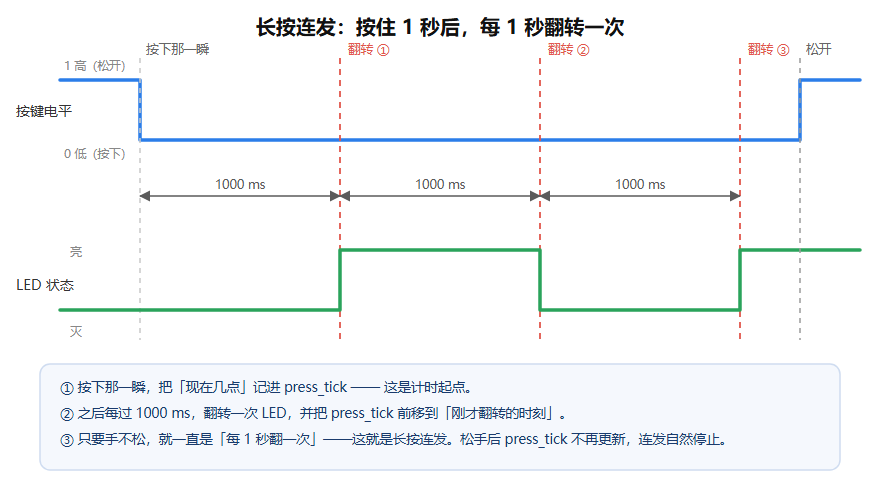

# 按键实验 ②：长按连发

> 对应《第 1 周执行手册》Day 3 的三种按键效果之一。
> 上一版你已经做出来的：**按一下 → 翻转一次**（点按型）。
> 这一版要做出来的：**按住 1 秒不松 → 灯开始每秒翻转一次，松手就停**（连发型）。



## 一、先搞懂一个新东西：`HAL_GetTick()`

```c
uint32_t HAL_GetTick(void);   /* 返回：从上电到现在过了多少毫秒 */
```

- 它由 **SysTick 定时器**在后台每 1ms 加一，你什么都不用配，开机就有。
- 上电 0.0 秒时返回 `0`，第 1 秒后返回 `1000`，第 3.5 秒返回 `3500`……
- 它的作用是：**问单片机「现在几点」**（单位是毫秒，不是真的钟表时间）。

### 为什么不用 `HAL_Delay(1000)` 来数 1 秒？

```c
/* ❌ 错误示范 */
if (按下) {
    HAL_Delay(1000);            /* 这 1 秒里 CPU 被"焊死"在这儿 */
    HAL_GPIO_TogglePin(...);    /* 期间按键松没松、别的事发生没有，全都不知道 */
}
```

`HAL_Delay` 是**死等**：这 1 秒内程序什么都不干，你松手它也发现不了。

正确做法是**非阻塞计时**——不"等"，而是每圈都问一句「从按下的那一刻算起，够 1000ms 了吗？」

```
够了吗？  → 没够 → 干别的，下圈再问
          → 够了 → 干活，并把起点挪到"现在"
```

这就是这张时间图的全部内容。

## 二、要改的地方：`main.c` 里两处

> 文件：`D:\STM32\CubeIDE_1x\test_led\Core\Src\main.c`

### 改动 1：加一个变量（在第 1 处空格的下面）

找到这一段（它在 `while (1)` **外面**）：

```c
  uint8_t last = HAL_GPIO_ReadPin(BTN_GPIO_Port, BTN_Pin);
```

在它**下面**加一行：

```c
  uint32_t press_tick = 0;      /* 记录"按下的那一刻"的毫秒时间戳 */
```

> `uint32_t` 是"32 位无符号整数"，能装 0 ~ 42 亿。毫秒计数到 42 亿要 49 天，
> 所以开机后很久也不会溢出（真溢出了用无符号减法算差值也是对的，这是额外知识点，先记住结论）。

### 改动 2：把 `while (1)` 里的按键逻辑换成下面这份（有 4 个空）

```c
  while (1)
  {
    uint8_t now = HAL_GPIO_ReadPin(BTN_GPIO_Port, BTN_Pin);   /* 这一圈读到几 */

    /* ---------- 第一段：按下那一瞬，把时间原点记下来 ---------- */
    if (last == GPIO_PIN_SET && now == GPIO_PIN_RESET)
    {
      press_tick = ______________;      /* 空1：问"现在几点了"，调哪个函数？ */
    }

    /* ---------- 第二段：只要还按着，够 1000ms 就翻一次 ---------- */
    if (now == ______________ && (HAL_GetTick() - press_tick) >= ______________)
    {
      /*              空2：按着的时候 now 是几？        空3：想按住多久才开始连发？ */

      HAL_GPIO_TogglePin(LED_GPIO_Port, LED_Pin);

      press_tick = ______________;      /* 空4：这里为什么必须再赋一次值？ */
    }

    last = now;        /* 把这次记住，留给下一圈比较 */
    HAL_Delay(10);     /* 每 10ms 查一次，别疯狂查 */
  }
```

## 三、四个空的提示（别急着看答案）

| 空 | 提示 |
|---|---|
| 空1 | 时间图的第 ① 步。「现在几点」= 调用 `HAL_GetTick()`，不带参数。 |
| 空2 | 上拉接法：**按下是低电平**。低电平在 HAL 里叫什么？`GPIO_PIN_RESET`。 |
| 空3 | 时间图写的是"按住 1 秒"。单位是**毫秒**，所以填数字 `1000`。 |
| 空4 | 想清楚：如果不重新赋值，`HAL_GetTick() - press_tick` 会越来越大，结果就变成"翻一次之后再也不翻了"。 |

## 四、答案（实在卡住再展开）

<details>
<summary>点这里看答案</summary>

```c
    if (last == GPIO_PIN_SET && now == GPIO_PIN_RESET)
    {
      press_tick = HAL_GetTick();                 /* 空1 */
    }

    if (now == GPIO_PIN_RESET && (HAL_GetTick() - press_tick) >= 1000)
    {                                             /* 空2 = GPIO_PIN_RESET，空3 = 1000 */
      HAL_GPIO_TogglePin(LED_GPIO_Port, LED_Pin);
      press_tick = HAL_GetTick();                 /* 空4 */
    }
```

完整可复制版（直接从 `uint8_t now` 粘到 `HAL_Delay(10);`）：

```c
    uint8_t now = HAL_GPIO_ReadPin(BTN_GPIO_Port, BTN_Pin);

    if (last == GPIO_PIN_SET && now == GPIO_PIN_RESET)
    {
      press_tick = HAL_GetTick();
    }

    if (now == GPIO_PIN_RESET && (HAL_GetTick() - press_tick) >= 1000)
    {
      HAL_GPIO_TogglePin(LED_GPIO_Port, LED_Pin);
      press_tick = HAL_GetTick();
    }

    last = now;
    HAL_Delay(10);
```

</details>

## 五、验收：现象对不对

烧录后应该看到：

1. 上电 → 灯先**亮**（CubeMX 生成的初始化里写了 `GPIO_PIN_RESET`）
2. **轻轻点一下**按键 → **没有任何反应**（因为点按不到 1 秒）
3. **按住不松** → 按满 1 秒后开始**每秒翻转一次**，一直翻
4. **一松手** → 立刻停在当前状态，不再翻

第 2 条"点一下没反应"是**故意**的——说明"长按"和"点按"是两套逻辑。
下一步会把两者合并：点按翻一次 + 长按连发。

## 六、今天要能回答（面试会问）

- `HAL_Delay(1000)` 和 `HAL_GetTick()` 计时，本质区别是什么？
- （答：前者让 CPU 死等、期间失去响应；后者不阻塞，CPU 每圈只做一次减法比较。）
- 为什么这个变量 `press_tick` 必须写在 `while (1)` **外面**？
- （答：写在里面每圈都会被重置成 0，时间差永远算不出 1000。）

## 七、下一步（做完这个再说）

- 合并短按 + 长按：松手时判断"按了多久"，`< 500ms` 算短按翻一次，否则不响应。
- 再进阶：双击检测（两次按下间隔 < 300ms）。
